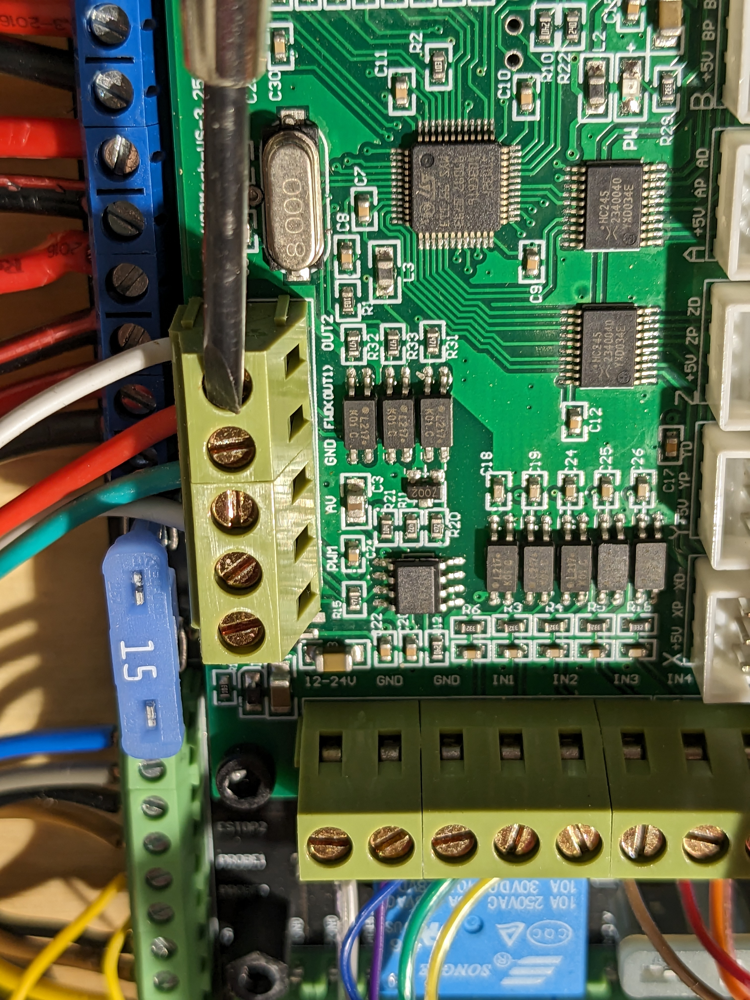
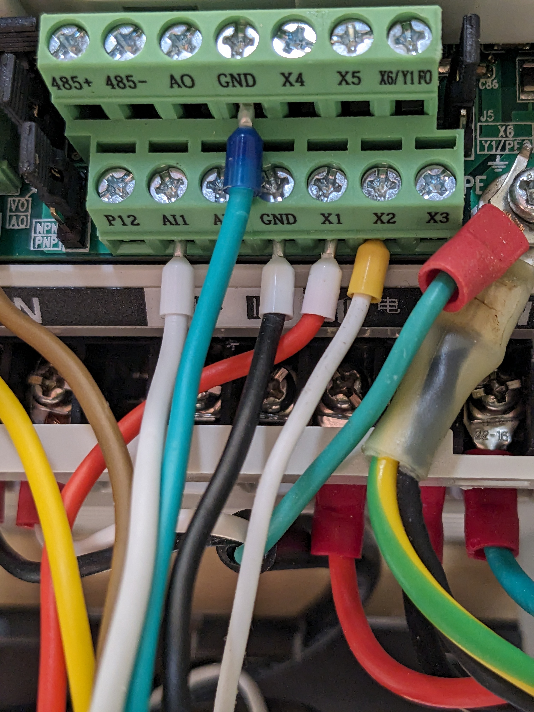

# DMC2-Enable-Spindle-Reverse
Many, many thanks to Guillaume Ferland who guilded me on how to do this.

The ability to switch the direction of the spindle via Mach3 with all the original parts of the DMC2 will allow you to
use the Rapid Change Tool Changer (which I have on order).
See https://rapidchangeatc.com/

This only requres one extra wire from the Mach3 board to the VLF controller.

Simply connect the Mach3 output 3 (see photo) to the VLF X2 pin.

First, see which direction your spindle spins (should be CW).
1. test - CW => "m3 s1000" watched the direction "m5" to stop.
2. test - CCW => "m4 s1000" shouldn't do anything, "m5" to stop.

Then reconfigure Mach3 
1. Ports & Pins, setting Output 3 to be active low.
2. Ports & Pins, setting Spindle M3 to Output 2 (original used Output 1) and M4 to Output 1.
3. test - CW => "m3 s1000" watched the direction "m5" to stop.
4. test - CCW => "m4 s1000" should spin counter clock wise, use "m5" to stop.
5. Save setting once you confirm it works.

## Parts Used
| Tools.                         | Aprox Cost   | Link if I really like the tool |
| ------------------------------ |-------------:| :------------------------------|
| Iwiss crimper kit with Ferrules |         $25 | [Iwiss Ferrule Crimper Kit](https://www.amazon.com/gp/product/B07LCF39W9) |

## DMC2 Help
A number of DMC2 owners hang out on Discord at [3D Misfits/CNC](https://discord.gg/86fqsRfz).  
There is also the Facebook [Shariff DMC2 users group](https://www.facebook.com/groups/528581055557390/?ref=share) 

## Pictures
Google Album at: 
[https://photos.app.goo.gl/4f3hwRbnzF8DqHUU7](https://photos.app.goo.gl/4f3hwRbnzF8DqHUU7)

Mach3 output2 location on the board

VLF X2 Input location

Mach3 set output2 active low

Mach3 setup M3 and M4

